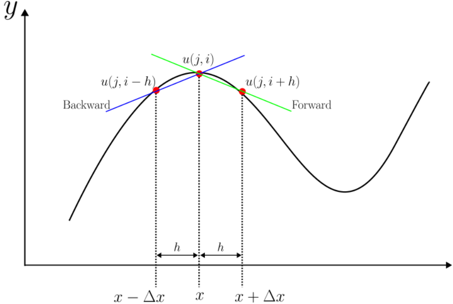
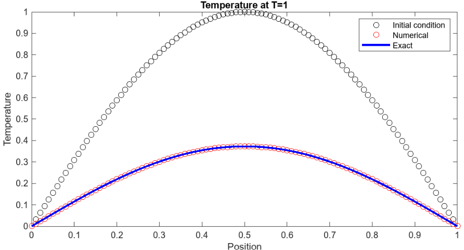
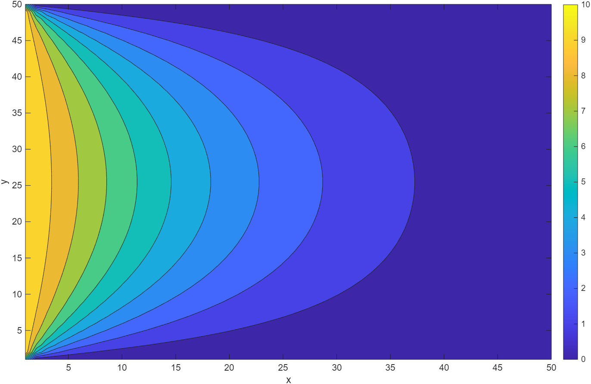
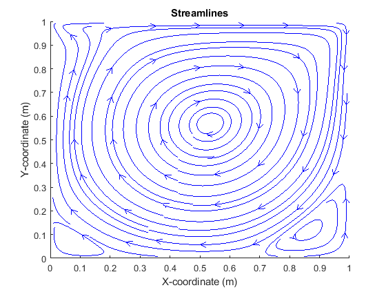
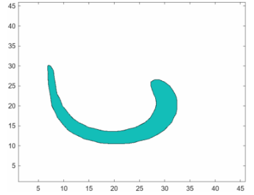
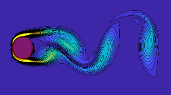

# Computational Fluid Dynamics Course Module

 or )

**Curriculum Module**

_Created with R2023b. Compatible with R2023b and later releases._

# Information

This curriculum module contains interactive [MATLAB® live scripts](https://www.mathworks.com/products/matlab/live-editor.html) that teach fundamental concepts of computational fluid dynamics. Topics addcressed include: numerical errors, solving partial differential equations, simulating fluid flow, interface advection, and fluid-structure interaction.

 
     

## Background

This course module features four chapters of teaching modules aimed at university students taking numerical methods or computational fluid dynamics. These course modules can be used within a classroom setting at a professor's direction, or used independently. Their goal is twofold. The first is to teach how to solve parabolic, hyperbolic, and elliptic equations using finite difference methods. The second is to learn how to build a CFD flow solver using the finite volume method to solve the full Navier-Stokes equations. This also includes learning the basics of interface advection for free surface flows and methods for fluid structure interaction.

Each script contains a Motivation section followed by the Learning Objectives and a Table of contents. They explain various topics alongside images, mathematical equations and code which is meant to be Run by the user.

By the end of this teaching module you will have a broad understanding on how to solve the Navier-Stokes equations with the appropriate boundary conditions to simulate fluid flow. In addition, you will understand how to modify the solution to achieve greater accuracy or faster solver times. 

## Prerequisites

These scripts assume some background knowledge in fluid dynamics, numerical methods and integral [Calculus](https://www.mathworks.com/matlabcentral/fileexchange/105740-calculus-integrals). Basic MATLAB knowledge is required and can be obtained from the [MATLAB Onramp](https://matlabacademy.mathworks.com/details/matlab-onramp/gettingstarted). It is not necessary to complete every module, however, the interface advection and fluid-structure interaction modules are built on the framework established in the computational fluid dynamics course module. It is recommended to complete the CFD module before the subsequent.

## Getting Started

**On MATLAB Online:**

Use the  link to download the module. You will be prompted to log in or create a MathWorks account. The project will be loaded, and you will see Overview.mlx laying out the contents of the repository.

**On Desktop:**

Open CFD.prj to set up the project. The project will be loaded, and you will see Overview.mlx laying out the contents of the repository.

**Working through the module:**

Get started with each topic by clicking the link to open the live script. The instructions inside each live script will walk you through the live script and related functions.

## Prodcuts
MATLAB® is required to complete the course modules.

# Scripts
|      |      |      |      |
| :-- | :-- | :-- | :-- |
| **Topic**    | **Summary**    | **Learning Objectives**    | **Mode**     |
|  **Intro to finite difference methods and numerical errors** in    [**numericalErrors.mlx** ](https://matlab.mathworks.com/open/github/v1?repo=coryhoi/Computational-Fluid-Dynamics-Course_Module&file=FiniteDifferenceMethods/numericalErrors.mlx)      | This script introduces the motivation behind solving partial differential equations, using finite difference methods to solve them, and the numerical errors behind computing.    | \* Understand basic sources of error in computing    | Code Hidden     |
|  **Solving parabolic equations** in [**parabolicEquations.mlx**](https://matlab.mathworks.com/open/github/v1?repo=coryhoi/Computational-Fluid-Dynamics-Course_Module&file=FiniteDifferenceMethods/parabolicEquations.mlx)        | Introduction to solving parabolic partial differential equations.   | \* Determine local truncation error   \* How to perform stability analysis and fine stability criteria   \* Learn to test if the solution is converging  | Code Visible     |
| **Solving hyperbolic equations** in [**hyperbolicEquations.mlx**](https://matlab.mathworks.com/open/github/v1?repo=coryhoi/Computational-Fluid-Dynamics-Course_Module&file=FiniteDifferenceMethods/hyperbolicEquations.mlx)        | Learn about specific methods for solving hyperbolic equations.    | \* Understand the direction of information travel and which numerical schemes are needed   \* The stability criteria   \* Dispersion    | Code Visible     |
|  **Solving elliptic equations** in [**ellipticEquations.mlx**](https://matlab.mathworks.com/open/github/v1?repo=coryhoi/Computational-Fluid-Dynamics-Course_Module&file=FiniteDifferenceMethods/ellipticEquations.mlx)        | Learn how to solve boundary value problems.   | \* Identify thermal sources, sinks, and reservoirs   \* Learn how to use iterative methods to solve solutions for steady state problems.    | Code Visible     |
|  **Solving incompressible Navier-Stokes equations** in [**flowSolver_teachingModule.mlx**](https://matlab.mathworks.com/open/github/v1?repo=coryhoi/Computational-Fluid-Dynamics-Course_Module&file=NavierStokes/flowSolver_teachingModule.mlx)        | Learn how to solve the 2D incompressible NSE and build the entire solver.   | \* Learn how to setup a staggered grid of variables   \* How to setup velocity and pressure boundary conditions   \* Learn how to solve the x and y momentum equations   \*  Two step projection method for divergence free velocity field   | Code Visible     |
| **Building an interface advection scheme (SLIC)** in [**interfaceAdvectionTeachingModule.mlx**](https://matlab.mathworks.com/open/github/v1?repo=coryhoi/Computational-Fluid-Dynamics-Course_Module&file=InterfaceAdvection/interfaceAdvection_teachingModule.mlx)       | Learn how to build an interface advection scheme using the Volume-of-Fluid method and the SLIC geometric reconstruction method.    | \* Simple line interface construction   \* Flux calculation    | Code Visible     |
| **Fluid structure interaction** in [**FSI_teachingModule.mlx**](https://matlab.mathworks.com/open/github/v1?repo=coryhoi/Computational-Fluid-Dynamics-Course_Module&file=FluidStructureInteraction/FSI_teachingModule.mlx)       | Learn how to introduce an immersed structure into the fluid domain.    | \* Classic immersed boundary method for elastic structures.   \* Direct forcing fictitious domain method for rigid bodies.   | Code Visible  
|      |      |      |      |

Copyright 2025 The MathWorks, Inc
